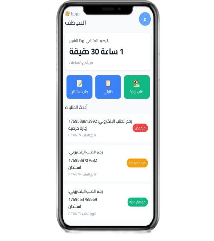
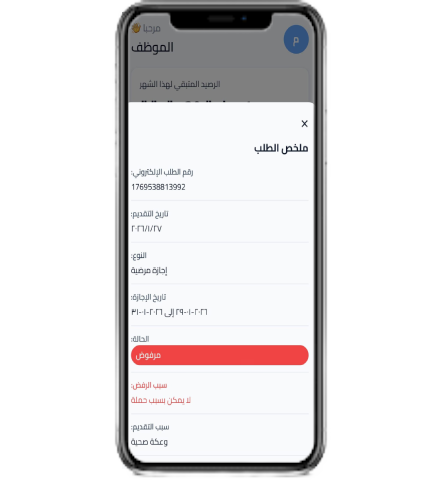

# HR App - Employee Request Management System

A comprehensive React Native mobile application for managing employee leave requests, absence permissions, and administrative review workflows.

## Screenshots

<table>
  <tr>
    <td align="center">
      
      <p><b>Login Screen</b></p>
    </td>
    <td align="center">
      
      <p><b>Employee Dashboard</b></p>
    </td>
    <td align="center">
      
      <p><b>Request Summary Modal</b></p>
    </td>
  </tr>
</table>

## Overview

The HR App is a full-featured human resources management system built with React Native and Expo. It streamlines the process of submitting and tracking leave requests, managing employee information, and providing administrators with tools to review and approve/reject requests.

## Features

### Employee Features
- **Dashboard**: View remaining balance and recent requests at a glance
- **Leave Requests**: Submit absence (استئذان) requests with time selection and signature
- **Annual Leave**: Apply for annual/medical/special leave with date range selection
- **Request History**: View all submitted requests with search and filter capabilities
- **Request Details**: Tap any request to view complete details including status and rejection reasons
- **Profile Management**: Edit personal information and view employee details
- **Notifications**: Real-time notifications for request submissions and status updates
- **Date Picker**: Interactive calendar with special date indicators and proper weekday alignment

### Admin Features
- **Dashboard**: Review all employee requests with search and filter options
- **Request Management**: Approve or reject requests with optional rejection reasons
- **Status Tracking**: View request status (Pending, Approved, Rejected)
- **Filter & Search**: Quickly find requests by employee, type, date, or order ID

### General Features
- **Arabic UI**: Full Arabic language support with RTL layout
- **Arabic Numbers**: All dates and numbers displayed in Arabic numerals
- **Pagination**: Navigate through requests with previous/next controls
- **Modal Details**: Comprehensive request summary with formatted dates and times
- **Status Indicators**: Color-coded status pills for quick status identification
- **Data Persistence**: AsyncStorage for local data persistence

## Tech Stack

- **Framework**: React Native with Expo (v54.0.31)
- **Navigation**: expo-router (v6.0.21)
- **State Management**: React Context API
- **Icons**: @expo/vector-icons (Ionicons)
- **Notifications**: expo-notifications (v0.32.16)
- **Storage**: @react-native-async-storage/async-storage
- **Fonts**: expo-font (Cairo family - Arabic support)
- **Date Handling**: JavaScript native Date object with custom formatting

## Project Structure

```
hr-app/
├── app/
│   ├── _layout.js                 # Root navigation with bottom tabs
│   ├── index.js                   # Landing/home page
│   ├── (admin)/
│   │   └── dashboard.js           # Admin dashboard
│   ├── (auth)/
│   │   ├── _layout.js
│   │   └── login.js
│   ├── (employee)/
│   │   ├── home.js                # Employee home dashboard
│   │   ├── profile.js             # Employee profile
│   │   └── requests/
│   │       ├── leave.js           # Absence request form
│   │       ├── annual-leave.js    # Annual leave request form
│   │       └── list.js            # Request history list
│   └── components/
│       └── SuccessTick.js         # Success animation overlay
├── constants/
│   ├── colors.js                  # Color palette
│   └── fonts.js                   # Font configuration
├── context/
│   └── RequestsContext.js         # Global request state management
├── assets/
│   └── fonts/                     # Cairo font files
├── app.json                       # Expo configuration
├── package.json
└── README.md
```

## Installation

### Prerequisites
- Node.js (v14 or higher)
- npm or yarn
- Expo CLI (`npm install -g expo-cli`)

### Setup Steps

1. **Clone the repository**
```bash
git clone https://github.com/yourusername/hr-app.git
cd hr-app
```

2. **Install dependencies**
```bash
npm install
# or
yarn install
```

3. **Install Expo Go** (on your mobile device)
   - Download "Expo Go" from App Store (iOS) or Google Play (Android)

4. **Start the development server**
```bash
npm start
# or
expo start
```

5. **Run the app**
   - Scan the QR code with Expo Go (Android) or Camera app (iOS)
   - Or press `i` for iOS simulator or `a` for Android emulator

## Usage

### Employee Workflow

1. **Dashboard Access**
   - Login and navigate to Home tab
   - View remaining balance for the month
   - See recent requests

2. **Submit Leave Request**
   - Tap "طلب استئذان" (Leave Request)
   - Select date and time
   - Add signature if required
   - Submit request

3. **Submit Annual Leave**
   - Tap "طلب إجازة" (Annual Leave)
   - Select leave type (Annual/Medical/Special)
   - Choose start and end dates using the calendar picker
   - Add reason
   - Submit request

4. **Track Requests**
   - Go to "طلباتي" (My Requests)
   - Search by order ID, type, or date
   - Filter by status (All/Approved/Rejected/Pending)
   - Tap any request to view full details

### Admin Workflow

1. **Dashboard Access**
   - Navigate to Admin tab
   - View all pending requests

2. **Review Requests**
   - Search for specific requests
   - Filter by status
   - Tap request to view details

3. **Approve/Reject**
   - Click status button in request modal
   - For rejection: provide reason
   - System updates employee immediately

## Key Features Explained

### Calendar Date Picker
- Interactive month navigation with "Previous/Next" labels
- Proper weekday alignment (Sunday-Saturday)
- Arabic day name headers
- Special date indicators with colored backgrounds and icons
- Disabled dates for end date selection (only future dates available)

### Request Summary Modal
- **Order ID**: Unique identifier for each request
- **Application Date**: When the request was submitted
- **Request Type**: Leave, Annual Leave, etc.
- **Date & Time**: Formatted with Arabic numbers
- **Status**: Color-coded (Green=Approved, Red=Rejected, Orange=Pending)
- **Rejection Reason**: Only shown for rejected requests
- **Notes**: Additional information or reason for request

### Search & Filter
- Search by order ID, request type, date, or notes
- Filter by status (All/Approved/Rejected/Pending)
- Pagination for large request lists
- Pagination controls with Arabic numerals

## API Reference

### Request Object Structure

```javascript
{
  id: number,                    // Unique identifier (Date.now())
  type: string,                  // e.g., "استئذان", "إجازة سنوية"
  status: string,                // "قيد المراجعة", "موافق عليه", "مرفوض"
  createdDate: string,           // YYYY-MM-DD
  
  // For regular leave
  date: string,                  // YYYY-MM-DD
  fromTime: string,              // HH:MM format
  toTime: string,                // HH:MM format
  durationMinutes: number,       // Total duration
  
  // For annual leave
  startDate: string,             // YYYY-MM-DD
  endDate: string,               // YYYY-MM-DD
  reason: string,                // Reason for request
  
  // Common fields
  employeeName: string,
  role: string,
  department: string,
  notes: string,
  signatureExists: boolean,
  rejectionReason: string        // Only for rejected requests
}
```

## Context Methods

### RequestsContext

**useRequests() Hook**

```javascript
const { 
  requests,           // Array of all requests
  addRequest,         // (request) => void
  updateStatus,       // (id, status, reason?) => void
  deleteRequest,      // (id) => void
} = useRequests();
```

## Styling

The app uses a consistent color system and typography:

### Colors (constants/colors.js)
- Primary colors for actions and highlights
- Success/Error/Warning colors for status
- Text colors for hierarchy (primary, secondary, tertiary)
- Background colors for card and main surfaces

### Typography (constants/fonts.js)
- Cairo font family for Arabic text
- Weights: Regular, Medium, SemiBold, Bold
- Consistent sizing hierarchy

## Number & Date Formatting

All dates and numbers are converted to Arabic numerals (٠-٩) using the `toArabicNumbers()` function:
- Applied to all dates throughout the app
- Applied to order IDs and pagination numbers
- Provides better user experience for Arabic-speaking users

## Troubleshooting

### App won't start
```bash
# Clear cache and reinstall
npm install
expo start --clear
```

### Calendar dates not aligning correctly
- This has been fixed with proper `getCalendarGrid()` function
- Ensures proper weekday alignment

### Scrolling issues in request list
- Ensure `scrollEnabled={true}` in FlatList
- Check that `paddingBottom` is adequate for content

### Dates showing as "-"
- Verify `createdDate` field exists in request objects
- Check date format is YYYY-MM-DD

## Performance Optimization

- Memoized search/filter logic with `useMemo`
- Lazy loading with pagination (5 items per page)
- Efficient state management with Context API
- AsyncStorage for persistence

## Future Enhancements

- [ ] Multi-year annual leave tracking
- [ ] Email notifications for request status
- [ ] Export requests as PDF
- [ ] Advanced analytics dashboard
- [ ] Bulk request operations
- [ ] Multi-language support (beyond Arabic/English)
- [ ] Offline mode with sync
- [ ] Biometric authentication

## Contributing

1. Fork the repository
2. Create a feature branch (`git checkout -b feature/AmazingFeature`)
3. Commit your changes (`git commit -m 'Add AmazingFeature'`)
4. Push to the branch (`git push origin feature/AmazingFeature`)
5. Open a Pull Request

## License

This project is licensed under the MIT License - see the LICENSE file for details.

## Support

For support, create an issue in the repository.

## Changelog

### Version 1.0.0 (Current)
- Initial release
- Employee leave request system
- Admin approval workflow
- Request tracking and history
- Arabic UI with number formatting
- Calendar date picker with special dates
- Request search and filter
- Modal request details view

---

**Last Updated**: January 28, 2026
